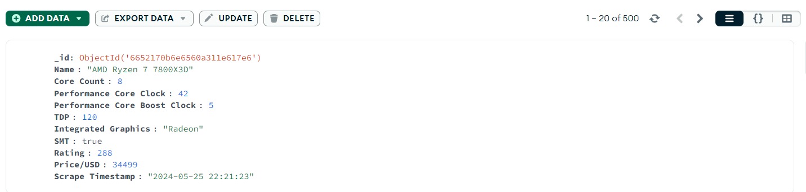

# Reference Scraper

## Overview

The Reference Scraper is a Python-based web scraping service designed to gather information about various computer parts from the 'PCPartPicker' website.

The product categories that have been considered here are CPU, Video-card, Memory, Motherboard, Monitor and keyboard.

It navigates through different categories, retrieves the number of pages for each category, and stores this information for further use.

## Setup
To run the Flask app
`python scraper.py`

## Libraries used

- requests
- lxml
- pymongo
- pandas
- undetected_chromedriver
- re
- bs4
- selenium
- datetime

### Prerequisites

- Python 3.10
- pip (Python package installer)

## Endpoints

This service contains 4 main end points
- /scrape-all- POST request to start the scraping process and send the data to the reference database
- /get-all -GET request to retrieve the data from the reference database
- /status- To get the working status of the service
- /delete- To delete old data 
(database stores the scrape timestamp while storing the data. This can be used to delete the unwanted data after a specific time period)

## Database

This service uses a MongoDB database for storing the scraped reference data. Details related to the database connection have been used in the connecttoDB() function in the scrape.py file.

Details related to every product received from scraping are stored in the database as a separate document.

## Scraping

Undetected chrome-driver has been used to avoid the IP getting banned from 'PCPartPicker' website.

